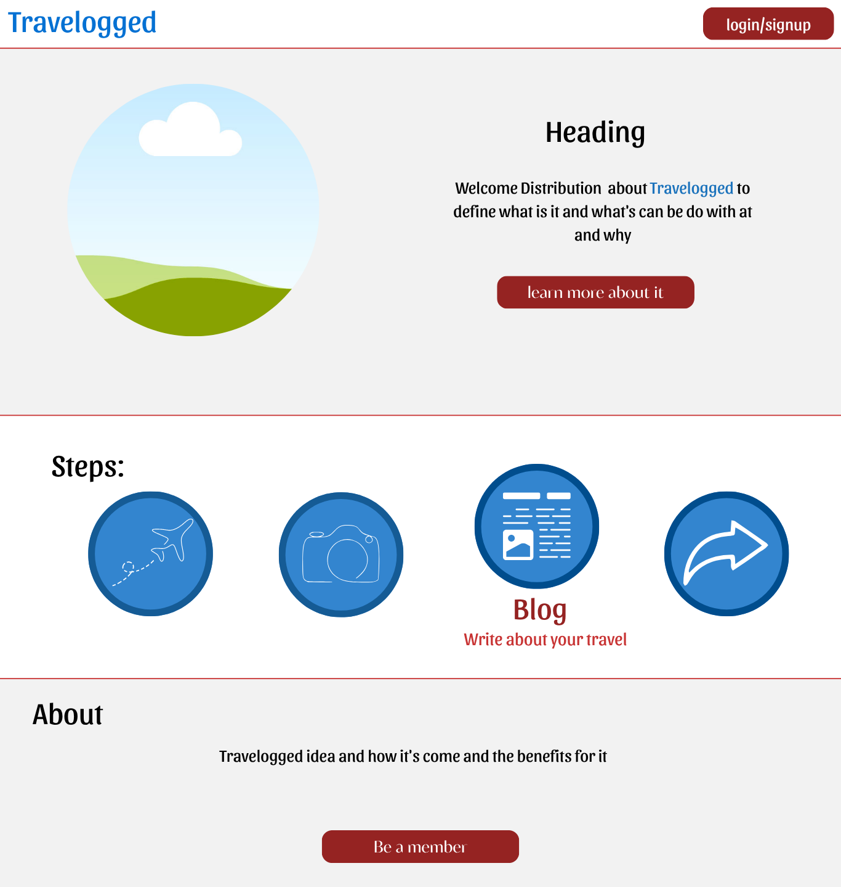
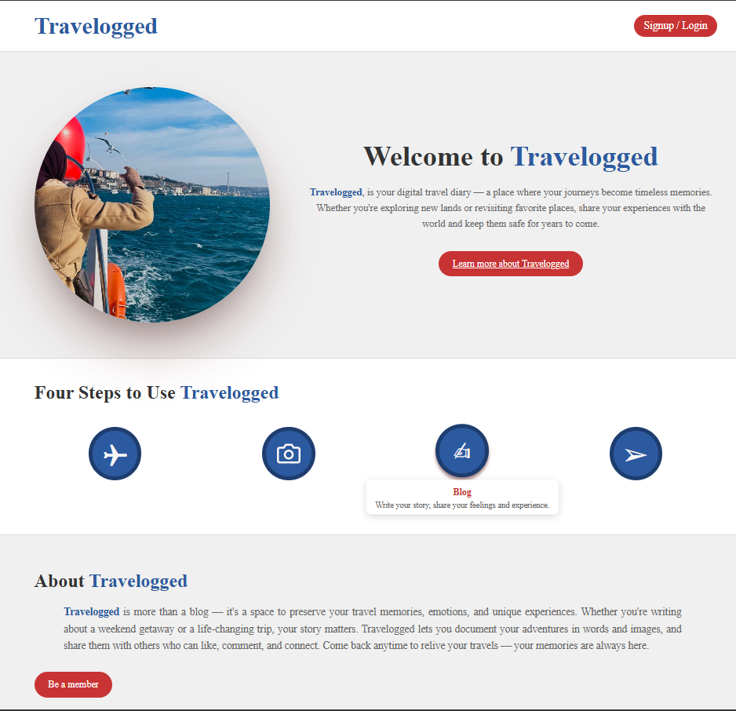

# 🌍 Travelogged ✈  
## A Social Travel Blogging Platform

**Travelogged** is a vibrant travel blogging platform where users can share their travel stories, photos, background music, and receive feedback through comments and likes. Users can explore all blogs, search by user, country, or city, and interact with the community — while managing their own content securely.

---

## 🧭 Table of Contents

- [Features](#-features)
- [User Stories](#-user-stories)
- [Technologies Used](#-technologies-used)
- [Installation](#-installation)
- [API Endpoints](#-aPI-endpoints)
- [Route Table](#-route-table)
- [Project Structure](#-project-structure)  
- [Wireframes](#-wireframes)
- [Future Enhancements](#-future-enhancements)

---

## ✨ Features

- User signup and login (with card-style flip form)  
- Users can create, edit, and delete travel blogs  
- Each blog includes: Title, Image, Country, City, Date, Duration, and Story  
- All blogs are displayed publicly on the homepage  
- Like and comment system for blog interaction (on posts and comments)  
- Users can view other users’ **public profiles**, including their posts, liked posts, and comments  
- Search blogs by user, country, or city  
- Only blog owners can edit or delete their blogs

---

## 👤 User Stories

- As a user, I can sign up and log in securely  
- As a user, I can create a blog with text and image  
- As a user, I can view all blogs from other travelers  
- As a user, I can search for blogs by country, city, or username  
- As a user, I can like and comment on blogs **and comments**  
- As a user, I can edit or delete only my own blogs  
- As a user, I can view public profiles of other users 

---

## 🛠️ Technologies Used

- Node.js  
- Express.js  
- MongoDB + Mongoose  
- EJS (Embedded JavaScript Templates)  
- Multer (for file uploads)  
- bcrypt (for password hashing)  
- dotenv  
- Method-Override  
- Custom CSS  

---

## ⚙️ Installation

1. Clone the repository  
   ```bash
   git clone https://github.com/your-username/travelogged.git
   cd travelogged
   ```
2. Install dependencies
   ```bash
   npm install
   ```

3. Create a `.env` file with the following:
    ```bash
    MONGODB_URI=your_mongo_connection_string
    SESSION_SECRET=your_session_secret
    ```

4. Start the development server
    ```bash
    npm run dev
    ```
---

## 📡 API Endpoints

### POST /blogs/:id/like
- Description: Like a specific blog post
- Request body: *none*
- Response: `{ success: true, updatedLikes: number }`

### POST /blogs/:id/comment
- Description: Add a comment to a blog post
- Request body:
```json
{
  "text": "Great trip!"
}
```
--- 

## 🗺️ Route Table
| Method | Route | Description | Access |
|--------|-------|-------------|--------|
| GET | `/` | Show all blogs (Homepage) | Public |
| GET | `/signup` | Show signup form | Public |
| POST | `/signup` | Handle user signup | Public |
| GET | `/login` | Show login form | Public |
| POST | `/login` | Handle login | Public |
| GET | `/logout` | Handle logout | Auth Users |
| GET | `/blogs/new` | Show create blog form | Auth Users |
| POST | `/blogs` | Submit new blog | Auth Users |
| GET | `/blogs/:id` | Show single blog | Public |
| GET | `/blogs/:id/edit` | Show blog edit form | Blog Owner |
| PUT | `/blogs/:id` | Handle blog update | Blog Owner |
| DELETE | `/blogs/:id` | Delete blog | Blog Owner |
| POST | `/blogs/:id/like` | Like a blog | Auth Users |
| POST | `/blogs/:id/comment` | Add comment | Auth Users |
| POST | `/comments/:id/like` | Like a comment | Auth Users |
| GET | `/search` | Search by user, country, or city | Public |
| GET | `/profile/:id` | View public profile of a user | Public |

---

## 📁 Project Structure
```bash
    travelogged/
    ├── server.js                 # Entry point of the app
    ├── app.js                    # Express app configuration
    ├── .env                      # Environment variables
    ├── .gitignore                # Files and folders Git should ignore
    ├── package.json              # Project metadata and dependencies
    │
    ├── models/                   # Mongoose models
    │   ├── db.js                 # MongoDB connection setup
    │   ├── auth.js               # User (traveler) schema
    │   └── post.js               # Travel post schema
    │
    ├── controllers/              # App logic organized by feature
    │   ├── auth/
    │   │   ├── dataController.js           # Auth-related DB operations
    │   │   ├── apiController.js            # Login/signup API logic
    │   │   ├── routeController.js          # Auth route definitions
    │   │   └── viewController.js           # Render auth views
    │   ├── posts/
    │   │   ├── dataController.js           # Travel post DB operations
    │   │   ├── apiController.js            # Travel post API logic
    │   │   ├── routeController.js          # Travel post routes
    │   │   └── viewController.js           # Render post-related views
    │   ├── profile/
    │   │   ├── profileController.js        # Travel post DB operations
    │   │   ├── profileRoutes.js            # Travel post API logic
    │   │   └── profileViewController.js    # Travel post routes
    │   └── user/
    │   │   └── userRoutes.js           # User route configuration
    │
    ├── public/                   # Image folder
    │   ├── uploads/              # User image uploding
    │   └── images                # Images for the project
    │
    ├── routes/
    │   └── apiRoutes.js          # API route configuration
    │
    ├── views/                    # Frontend views using JSX
    │   ├── auth/
    │   │   ├── SignUp.jsx        # User registration page
    │   │   ├── SignIn.jsx        # User login page
    │   │   ├── Profile.jsx       # Current user profile page
    │   │   ├── EditProfile.jsx   # Edit user page
    │   │   └── PublicProfile.jsx # Users public profile page
    │   └── posts/
    │       ├── Index.jsx         # Explore all travel posts
    │       ├── Show.jsx          # Single travel experience view
    │       ├── New.jsx           # Create new travel post
    │       ├── Edit.jsx          # Edit an existing post
    │       └── Home.jsx          # Show web home page
    │
    ├── tests/
    │   ├── auth.test.js          # Tests for user-related features
    │
    └── README.md                 # Project overview and instructions

```
---

## 🧱 [Wireframes](https://www.canva.com/design/DAGuvqXvQpU/TQ6v3UIkLobbhJCiB6vclg/edit?utm_content=DAGuvqXvQpU&utm_campaign=designshare&utm_medium=link2&utm_source=sharebutton) 

Travelogged uses a clean and simple layout designed to make the user experience smooth and enjoyable. The design relies on **four main colors** — **red, blue, gray, and white** — to keep things visually balanced and readable.


*Most pages follow a consistent structure:*
- A **navigation bar** at the top for easy access to key pages.
- A **header section** introducing the page's purpose.
- A **main content area**, usually styled like a **"pig card" layout** — large, clear, and content-focused cards that group related information together.




---

## 🖥️ Landing Page (with Card Flip)
- Left: Signup card

- Right: Login card (flips on toggle)

- Button: “Already have an account?” → flips the card

---

## 🏠 Blogs Page (after login)
- Blog grid or list view

- Each blog shows image, title, creater, likes, city, and country

- Search bar (top): user, country, city

---

## ➕ Create/Update Blog
- Form with:
    - Title
    - Image upload
    - Country & City
    - Travel Date
    - Duration
    - Text area for story

---

## 💬 Blog Details Page
- Shows full blog with:
    - Full description and Image
    - Comments section
    - Like button
    - Edit/Delete options (if owner)

---

### 🙋‍♂️ Public Profile Page
- When visiting another user’s public profile, you can view:
  - Name
  - Bio  
  - Blog posts  
  - Liked posts  
  - Comments 

---

## 🔮 Future Enhancements
- Pagination or infinite scroll on the blog list  
- Add tags/categories for filtering  
- Email verification and password reset  
- Dark mode support  
- Save favorite blogs 

